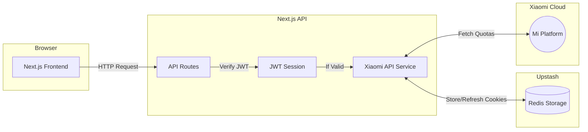

<div align="center">
  <h1>MiMo Usage Dashboard</h1>
  <p><strong>A modern, multi-account dashboard for monitoring Xiaomi MiMo Token usage & API Limits</strong></p>
  

  <br />
  <br />

  
  
  
  
</div>

<br />

## Overview

MiMo Usage is a Next.js application that provides a beautiful, centralized dashboard to monitor your Xiaomi API usage. You can securely log in to multiple Xiaomi accounts, track your token consumption in real-time, generate API keys, and receive quota alerts—all in a sleek interface.

## Architecture



## Features

- **Multi-Account Support**: Add and manage multiple Xiaomi accounts simultaneously.
- **Real-time Analytics**: Beautiful charts powered by Recharts to track your token usage.
- **Secure Authentication**: Edge-compatible JWT-based session protection.
- **API Key Management**: Generate and reset API keys per account natively.
- **Dark Mode**: Built-in sleek dark theme support.

## Tech Stack

- **Framework**: [Next.js 16](https://nextjs.org/) (App Router, Turbopack)
- **Styling**: [Tailwind CSS v4](https://tailwindcss.com/) & [shadcn/ui](https://ui.shadcn.com/)
- **Icons**: [Phosphor Icons](https://phosphoricons.com/)
- **Auth**: [Jose](https://github.com/panva/jose) (JWT)
- **Database**: [Upstash Redis](https://upstash.com/) (Serverless Session Storage)

## Getting Started

1. **Install dependencies:**
   ```bash
   bun install
   ```

2. **Environment Variables:**
   Create a `.env.local` file based on the `.env.local.example` structure:
   ```env
   # Protect your dashboard (optional)
   DASHBOARD_PASSWORD="YourSuperStrongPassword"

   # Secret for JWT signing
   AUTH_SECRET="your-32-byte-hex-string"

   # Upstash Redis (Required for session storage)
   UPSTASH_REDIS_REST_URL="https://your-upstash-url.upstash.io"
   UPSTASH_REDIS_REST_TOKEN="your-upstash-token"
   ```

3. **Run the development server:**
   ```bash
   bun run dev
   ```
   Open [http://localhost:3000](http://localhost:3000) with your browser to see the result.

## Contributing

We welcome contributions to MiMo Usage! If you want to add a new feature or fix a bug, please follow these steps:

1. **Fork the repository** on GitHub.
2. **Clone your fork** locally: `git clone https://github.com/your-username/Mimo-Usage.git`
3. **Create a new branch** for your feature: `git checkout -b feature/your-feature-name`
4. **Make your changes** and commit them: `git commit -m "feat: add new feature"`
5. **Push to your fork**: `git push origin feature/your-feature-name`
6. **Open a Pull Request** against the `main` branch of the original repository.

## Deployment

Easily deploy your own instance of MiMo Usage to Vercel with a single click:

<a href="https://vercel.com/new/clone?repository-url=https%3A%2F%2Fgithub.com%2F0xtbug%2FMimo-Usage&env=AUTH_SECRET,DASHBOARD_PASSWORD,UPSTASH_REDIS_REST_URL,UPSTASH_REDIS_REST_TOKEN">
  
</a>
